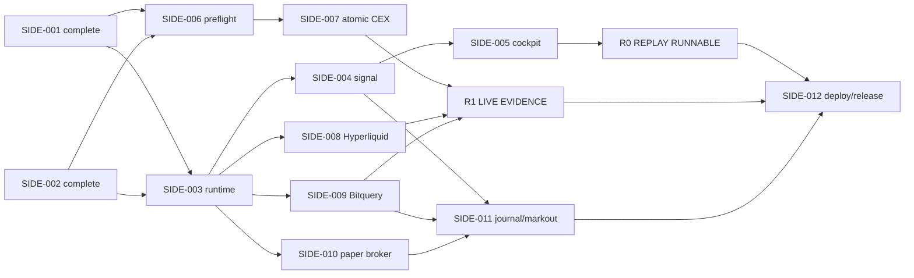

# S0 - Runnable Product Slice

状态：**IN EXECUTION · R0 REPLAY RUNNABLE · SIDE-016 SHADOW UI COMPLETE · SIDE-006 LOCAL GATES COMPLETE / AWS GATE BLOCKED**
基线日期：2026-09-04
已完成依赖：[SIDE-001](SIDE-001_SOURCE_FREEZE.md)、[SIDE-002](SIDE-002_FOUNDATION.md)

## 1. 最终交付定义

S0 是一条可以从全新 checkout 启动、验证和演示的 SOL-only 决策路径：

```text
canonical live/replay events
  -> four market juries
  -> BUY BIAS / SELL BIAS / NO EDGE / INSUFFICIENT DATA
  -> user reviews a fresh $10k SOL-USDC paper estimate
  -> record BUY / SELL / WAIT
  -> +5m markout or explicit unscored
```

最终必须同时支持两种诚实、互斥的运行状态：

- `REPLAY`：无 API key 也能运行 golden scenario；页面、事件和 paper preview 全程显示 REPLAY，不冒充 live；
- `LIVE`：只启用 SIDE-001 选择出的原子 CEX profile、Hyperliquid 和 Bitquery。少于三个 fresh juries 时显示 `INSUFFICIENT_DATA` 并禁用 live paper preview。

目标启动与验收命令：

```bash
pnpm install --frozen-lockfile
pnpm check
pnpm dev:s0
pnpm smoke:s0
```

## 2. 冻结的用户路径

1. 打开首页，固定显示 `SOL · 5 MIN WINDOW`、当前 `LIVE/REPLAY` mode 和 source coverage；
2. 四个 jury 分别显示 CEX spot、CEX perp、DEX spot、DeFi perp 的 vote、age 和最多两条 reason；
3. 中央 verdict 只有四种状态：`BUY BIAS`、`SELL BIAS`、`NO EDGE`、`INSUFFICIENT DATA`；
4. 用户打开 paper drawer；首次只请求 0x estimate；
5. 0x 失败时先显示 unavailable，用户可明确选择 `TRY JUPITER ESTIMATE`；
6. 用户记录 `PAPER BUY`、`PAPER SELL` 或 `RECORD WAIT`；不签名、不广播；
7. 系统保存 decision-time evidence，并在五分钟后写 markout 或明确写 `unscored`；
8. 任一 live source 断流时，该 jury fail closed；demo 可以由用户明确切换到 REPLAY，不能静默替换。

## 3. 可执行 tasks

### 已完成

| Task | 状态 | 产物 |
|---|---|---|
| SIDE-001 | COMPLETE | S0 source/execution freeze；Coinbase primary、Binance atomic fallback、Bitquery realized flow、0x/Jupiter policy |
| SIDE-002 | COMPLETE | TypeScript workspace、canonical contracts、JSONL recorder/replay、deterministic clock、golden fixture |

### SIDE-003 - Runnable runtime spine

状态：**COMPLETE**；验收记录见 [SIDE-003](SIDE-003_RUNTIME_SPINE.md)。

依赖：SIDE-002。

交付：

- `apps/server` Fastify 进程与 `apps/web` React/Vite 进程；
- `pnpm dev:s0` 同时启动 server/web；
- `GET /health/live`、`GET /health/ready`、`GET /health/sources`、`GET /api/state`；
- `POST /api/replay/start|stop`，把 SIDE-002 fixture 推入 canonical pipeline；
- backend → browser WebSocket 的 `state_snapshot`、`ui_event`、`source_health`、`resync_required` 最小协议；
- 有界队列与全局 `ingestSeq` allocator。

退出条件：全新 checkout 可启动；无 secret 时默认进入明确标记的 REPLAY；fixture 能从 server 到浏览器；慢客户端不会形成无界队列。

### SIDE-004 - Deterministic jury and verdict engine

状态：**COMPLETE**；验收记录见 [SIDE-004](SIDE-004_SIGNAL_ENGINE.md)。

依赖：SIDE-002；接入 SIDE-003 pipeline。

交付：

- 固定 `modelVersion=s0-v1`；30 秒 price impulse 与 aggressor imbalance；
- CEX spot、CEX perp、DEX spot、DeFi perp 四个 jury；
- 两个 feature 同向且满足 minimum volume 才投 BUY/SELL，否则 NEUTRAL；
- 三个及以上 fresh jury 才允许 central verdict；3/4 同向为 BUY/SELL BIAS，否则 NO EDGE；
- 少于三个 fresh jury 为 `INSUFFICIENT_DATA`；
- `LIMITED_SOURCE_COVERAGE`、reason codes、feature snapshot；
- `spot-led`、`leverage-heavy`、`disagreement`、`stale` 四组 golden scenarios。

退出条件：同一 event log + model version 产生 byte-for-byte 相同 jury/verdict transitions；missing feature 不 zero-fill；quiet market 与 stale transport 行为不同。

### SIDE-005 - Event-driven cockpit

状态：**COMPLETE**；验收记录见 [SIDE-005](SIDE-005_EVENT_DRIVEN_COCKPIT.md)。

依赖：SIDE-003、SIDE-004。

交付：

- 固定 SOL / 5 MIN 页面；四个 venue zones、jury cards 和中央 verdict；
- 显示 mode、source/profile、coverage、freshness、last valid verdict；
- 50-100 ms visual micro-batch，显示 `×N`、buy/sell count 与 notional；
- event-id seeded motion、pause、hidden-page recovery、`prefers-reduced-motion`；
- paper drawer 外壳，先使用 replayed preview contract。

退出条件：REPLAY 端到端页面可演示；用户十秒内能说出 bias、是否一致、leading source 和原因；360/736/1024/1440 px 不遮挡 verdict。

完成 SIDE-005 后形成第一个可运行里程碑：**R0 · REPLAY RUNNABLE**。

### SIDE-006 - Source preflight and atomic profile selector

状态：**LOCAL REQUIRED GATES COMPLETE · TARGET AWS RUN BLOCKED**；验收记录见 [SIDE-006](SIDE-006_SOURCE_PREFLIGHT.md)。

依赖：SIDE-001、SIDE-002。

交付：

- 可在目标美国 AWS region 执行的 preflight CLI；
- 检测 Coinbase `SOL-USD`、Coinbase Derivatives `SLP`、Binance fallback、Hyperliquid、Bitquery、0x、Jupiter；
- 输出机器可读 JSON 与人可读 Markdown：endpoint、metadata/product id、entitlement、HTTP/WS status、429、p50/p95 RTT、失败原因；
- 只生成 `S0_CEX_PROFILE=coinbase|binance|unavailable`，禁止混搭；
- secret 只从环境/secret store 读取，报告必须脱敏。

退出条件：Coinbase spot 或 `SLP` 任一失败时整组选择 Binance；两组都失败时选择 unavailable；选择结果和原因可重复审计。

外部输入：目标 AWS 主机/region、Bitquery token、0x key；Jupiter key 只在需要验证 fallback 时提供。

### SIDE-007 - Atomic CEX live adapter

依赖：SIDE-002、SIDE-006。

交付：

- Coinbase `SOL-USD` status/level2/market trades adapter；
- Coinbase Derivatives `SLP` metadata discovery、5 SOL multiplier、BBO/trades adapter；
- Coinbase profile 失败时的 Binance spot + USDⓈ-M perp 原子 fallback；
- maker-side/aggressor 语义、snapshot/sequence/reconnect、时间与 Decimal string normalization；
- 每个实际启用 source 的脱敏 fixture 与 contract tests。

退出条件：只发布一个完整 CEX profile；任何半 profile 都 unavailable；CEX spot/perp 分别产生 canonical event、health 和 UI evidence。

### SIDE-008 - Hyperliquid live adapter

依赖：SIDE-002、SIDE-003。

交付：

- metadata 动态发现 SOL asset id；
- `l2Book` full-snapshot replace、trades、mark/oracle、funding、OI；
- reconnect/resubscribe、freshness 与 explicit unavailable；
- 不伪造 sequence-based delta recovery。

退出条件：DeFi perp jury 获得真实 canonical input；断流后在 freshness budget 内 fail closed；fixture contract tests 通过。

### SIDE-009 - Bitquery WSOL/USDC live adapter

依赖：SIDE-001、SIDE-002、SIDE-003。

交付：

- Bitquery US GraphQL WebSocket 双方向 WSOL/USDC subscription；
- economic swap grouping：同 signature route legs 只形成一个经济成交；
- logical dedupe、coverage manifest、`provider-indexed` finality；
- silent disconnect detection；live buffer + historical query checkpoint/backfill；
- unresolved gap 时 DEX jury unavailable；
- UI 固定标签 `BITQUERY-DECODED SOLANA DEX FLOW`。

退出条件：30 分钟 soak 有 packet/backfill age、重复率、parse failure、多腿比例和 p50/p95 latency；真实 signature fixture 覆盖单腿、多腿、重复与 gap。

完成 SIDE-007/008/009 后形成第二个里程碑：**R1 · LIVE EVIDENCE RUNNABLE**。SIDE-007、008、009 可以在 SIDE-003 完成后独立推进，但 LIVE gate 必须等待三者及原子 CEX profile 全部满足 coverage。

### SIDE-010 - Paper estimate broker

状态：**COMPLETE · PAPER ONLY · DURABILITY DELIVERED BY SIDE-011**；验收记录见 [SIDE-010](SIDE-010_PAPER_ESTIMATE_BROKER.md)。

依赖：SIDE-002、SIDE-003；LIVE record 依赖至少三个 fresh juries。

交付：

- `POST /api/paper-orders/preview` 与 `POST /api/paper-orders`；
- BUY：0x 10,000 USDC exact-in；
- SELL：同 provider 的 10,000 USDC→SOL anchor，再以该 SOL amount exact-in 卖出；
- SIDE 本地 10 秒 TTL、idempotency、source health recheck；
- 0x failure id；只有用户明确 action 才允许 Jupiter fallback；
- 只保存 sanitized estimate、route、request ids/times/hash；无 instruction body、signer、assembly、simulation 或 send client。

退出条件：success/429/timeout/schema drift/expired/mixed-provider/automatic-fallback tests 通过；静态扫描确认没有 live execution path。

历史实现说明：SIDE-010 最初只在有界进程内存中保留脱敏记录；该边界已由 SIDE-011 的 PostgreSQL journal 与 markout worker 取代。

### SIDE-011 - Decision journal and +5m markout

状态：**COMPLETE · POSTGRES DURABLE · PAPER ONLY**；验收记录见 [SIDE-011](SIDE-011_DECISION_JOURNAL_MARKOUT.md)。

依赖：SIDE-004、SIDE-009、SIDE-010。

交付：

- 最小 Postgres schema/migration：decision、evidence snapshot、preview/order、markout schedule/result；
- `PAPER BUY`、`PAPER SELL`、`RECORD WAIT`；
- `(decisionId, horizon, referencePolicyVersion)` idempotent markout；
- Bitquery robust realized-price reference；样本不足、gap 或异常时 `unscored`；
- 普通 raw feed 不无限落盘。

退出条件：重启后补跑到期 markout；重复 worker 不增加 sample count；BUY/SELL directional formula 对称。

### SIDE-012 - Resilience, deployment and release documentation

依赖：SIDE-003 至 SIDE-011。

交付：

- source fault injection、LIVE→unavailable、用户显式 REPLAY drill；
- Docker Compose：web、server、Postgres、reverse proxy；
- HTTPS、structured logs、health endpoints、secret injection、restart smoke test；
- `README`、`PRD`、`BUILD_AND_CUTS`、`TESTS_AND_FAILURES`、`PROCESS_LOG`、`DEMO_SCRIPT`；
- 10 分钟演示脚本和 `product-s0` freeze candidate。

退出条件：部署 URL 从无缓存浏览器可打开；LIVE/REPLAY 不混淆；完整主路径、断流路径和 paper path 均通过；所有文档与实际构建一致。

## 4. 依赖与里程碑



推荐执行顺序：`003 → 004 → 005 → 006 → (007, 008, 009) → 010 → 011 → 012`。不要在 R0 前先做全部外部 adapter；先保住始终可运行的 vertical slice。

## 5. S0 硬性 cuts

以下内容不进入 Product Slice：

- KuCoin、OKX、SOL-USDT；
- direct Solana RPC/program parser；
- 高频、无界或用于 signal 的 Jupiter/0x quote；当前只允许页面活跃时 5 秒共享 0x display sampler，Jupiter 仍不得自动调用；
- 多资产、timeframe picker、策略编辑器；
- 跨 USDC/USDT/USD 的绝对价格或 volume 合并；
- ML、已验证 alpha 或稳定因果 lead/lag 声明；
- CEX/Hyperliquid execution、wallet、signer、simulation、broadcast；
- production HA、长期 raw-feed retention、完整 PostgreSQL hardening。

任何新增项必须替换现有 S0 项而不是累加；否则进入 M0。

## 6. 最终 S0 Definition of Done

- [ ] 全新 checkout 使用四条目标命令完成安装、检查、启动和 smoke；
- [x] 无 secret 的 REPLAY flow 可完成 verdict → paper decision → markout/unscored；
- [ ] LIVE mode 只使用已选中的原子 CEX profile、Hyperliquid、Bitquery；
- [ ] 少于三个 fresh juries 时为 `INSUFFICIENT_DATA` 且 live preview 禁用；
- [ ] 0x primary / explicit Jupiter fallback 行为与审计字段通过测试；
- [ ] 任一 external failure 都有明确 unavailable/stale/gap 状态，不静默使用旧值；
- [ ] 无 signer、assembly、simulation、send code path；
- [ ] 部署链接、测试、process log、cuts 和 demo script 与实际实现一致。
