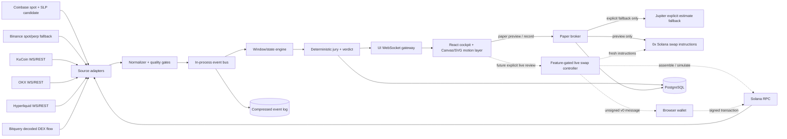

# SIDE - 技术架构与数据接入规范

状态：运行基线 v0.3；SIDE-001 source decision frozen
日期：2026-09-04
原则：单机可部署、模块可替换、事件可回放、信号可解释、执行默认 fail-closed。

## 1. 推荐架构

首版采用 **TypeScript modular monolith**，不要在一个 SOL demo 里提前引入 Kafka、微服务或多语言数据平台。



`Paper broker` 是硬安全边界：它可以请求 0x estimated output，但其依赖图和 production build 中都不存在 signer、transaction assembly 或 broadcast client。未来真钱路径由独立、feature-gated 的 live controller 承担，不能通过配置把 paper endpoint 原地升级为 live endpoint。

### 为什么是 modular monolith

- 一个 Node/TypeScript backend 可以共享 instrument metadata、Decimal 规则与 event schema；
- 在 AWS 单机上部署、观察和重启简单；
- adapter、signal、paper broker 仍以接口隔离，后续可以独立成进程；
- event log + replay 已经提供可测试性，不需要消息队列才算“实时”。

### 推荐代码结构

```text
apps/
  web/                    React UI + Canvas/SVG motion layer
  server/                 Fastify HTTP + WebSocket gateway
packages/
  market-core/            canonical types, Decimal/unit/time helpers
  venue-coinbase/         Coinbase SOL-USD + Coinbase Derivatives SLP candidate
  venue-binance/          atomic S0 fallback; M0 venue
  venue-kucoin/
  venue-okx/
  venue-hyperliquid/
  venue-bitquery-solana/  S0 decoded WSOL/USDC economic swaps
  venue-solana-dex/       M0 direct selected-pool/program swap ingest
  signal-engine/          rolling windows, jury, verdict, model version
  strategy-engine/        deterministic dry-run entry/scale/basket/exit state machine
  execution-paper/        preview, record, markout
  quote-zeroex/           typed 0x client used by paper preview; no signer/send
  quote-jupiter/          explicit paper fallback only; no signer/send
  execution-zeroex-live/  separate future live build only
  recorder-replay/        append log, fixtures, deterministic clock
infra/
  docker-compose.yml
  caddy/
docs/
```

SIDE-020 在 signal 与 execution 之间增加独立的策略 adapter/coordinator：adapter 将离散 verdict 映射成 versioned scalar edge，`@side/strategy-engine` 只接收 observation 并保持确定性状态，server coordinator 负责理论参考价、单 active run、原子 event batch、无事件 checkpoint、失败后 journal reconciliation 与轻量 restart recovery。REPLAY 只按录制事件间隔驱动，完成后的冻结 signal 不再被 wall clock 重采样；LIVE 才使用每秒 tick。event journal 保存 delta，完整 basket 独立持久化。它不复用人工 `PaperEstimateBroker`，因此未来将理论价替换为 perp depth/limit execution adapter 时，不会改变现有 0x preview/record 安全边界。首版假设单 server process；多副本执行前仍需增加 worker lease。

建议库类别而非固定版本：React、TypeScript、Fastify、原生 WebSocket client、Zod/Valibot 一类 schema validator、Decimal.js 一类十进制定点库、PostgreSQL。版本在 scaffold 时锁定并提交 lockfile。

---

## 2. 事件生命周期

```text
source packet
  -> adapter validates schema
  -> normalize timestamp / symbol / unit / side
  -> sequence + freshness gate
  -> canonical MarketEvent
  -> append raw-normalized event log
  -> update rolling state
  -> emit UiEvent to source zone
  -> recompute affected jury only
  -> if hysteresis crossed, emit VerdictChanged
  -> persist decision snapshot / paper markout
```

### 时间与顺序必须分开保存

- `occurredAtMs`：标准化后的发生时间；来源可能是 venue、block，也可能只能退化为 SIDE receive wall clock；
- `sourceEventTimeRaw`：源字段原文，尤其 ns/us 时间戳必须先以 string 保存，不能先经过 IEEE-754 `number`；
- `receivedAtUnixMs`：SIDE 收到事件的墙钟，用于日志和跨进程关联；
- `receivedMonoNs`：同一进程内的单调钟，用于 pipeline latency 与“collector observed first”；
- `ingestSeq`：normalizer 分配的稳定全局顺序。按 venue/hour 分片后的 replay 必须按它合并，不能靠相同或缺失的 source timestamp 猜顺序。

所有 lead/lag 与 latency 计算必须声明使用哪个时间。不同 venue 的时钟不能用于证明因果；首版只能严谨地声称“SIDE collector first observed”。AWS 主机仍需 NTP/chrony，但 timestamp rollback 按事件类型处理：stateful snapshot/delta 依靠 generation/cursor，trade 依靠 dedupe + bounded lateness，而不是一律丢弃。Coinbase/Bitquery/Binance 字段是否为 engine、block、gateway 或 receive time 必须逐字段映射；没有 source event time 的消息使用 `timeOrigin = "receive-fallback"`。

### 原生单位与标准单位并存

- 原始 contract 数量、quote asset、tick/lot/contract multiplier 全部保存；
- 另计算 `sizeSOL`、`notionalQuote` 与可选 `notionalUsdEquivalent`；
- 后端金额使用 Decimal/string，不使用 IEEE-754 `number` 做订单、费用或 PnL 权威值；
- USDC 与 USDT 不固定为 1:1；S0 至少保留 quote asset 并禁用无 conversion 的跨 numeraire feature，M0 用带 source/freshness 的 stable conversion state 做转换。

---

## 3. Canonical event contract

建议使用 discriminated union。下例只定义规划所需字段：

```ts
type SourceProvider =
  | "coinbase"
  | "coinbase-derivatives"
  | "binance"
  | "kucoin"
  | "okx"
  | "hyperliquid"
  | "bitquery"
  | "jupiter"
  | "zeroex"
  | "solana-rpc"
  | "managed-solana-stream";
type Venue =
  | "coinbase"
  | "coinbase-derivatives"
  | "binance"
  | "kucoin"
  | "okx"
  | "hyperliquid"
  | "solana-dex";
type Segment = "spot" | "perp" | "dex-spot";
type EventKind =
  | "bbo"
  | "book-delta"
  | "trade"
  | "mark"
  | "funding"
  | "open-interest"
  | "dex-quote"
  | "onchain-swap"
  | "route-change"
  | "source-health";

interface StreamCursor {
  first?: string;
  last?: string;
  previous?: string;
  snapshot?: boolean;
  connectionGeneration: number;
}

interface BaseEvent {
  schemaVersion: 1;
  eventId: string;
  ingestSeq: string;
  source: {
    provider: SourceProvider;
    channel: string;
    connectionGeneration: number;
  };
  venue: Venue;
  protocol?: string;
  segment: Segment;
  instrumentId: string;
  base: "SOL";
  quote: "USDT" | "USDC" | "USD";
  occurredAtMs: number;
  timeOrigin: "venue" | "block" | "receive-fallback";
  sourceEventTimeRaw?: string;
  sourceEventTimeUnit?: "ms" | "us" | "ns";
  receivedAtUnixMs: number;
  receivedMonoNs: string;
  cursor?: StreamCursor;
  quality: {
    state: "fresh" | "degraded" | "stale" | "gap";
    latencyMs?: number;
    outOfOrder: boolean;
    replay: boolean;
  };
}

type EventOf<K extends EventKind, P> = BaseEvent & { kind: K; payload: P };
```

关键 payload：

```ts
interface BboPayload {
  bidPx: string;
  bidSizeNative: string;
  bidSizeSOL: string;
  askPx: string;
  askSizeNative: string;
  askSizeSOL: string;
}

interface TradePayload {
  px: string;
  sizeNative: string;
  sizeSOL: string;
  aggressor: "buy" | "sell" | "unknown";
  tradeId?: string;
}

interface BookDeltaPayload {
  bids: Array<{ px: string; sizeNative: string; sizeSOL: string }>;
  asks: Array<{ px: string; sizeNative: string; sizeSOL: string }>;
}

interface MarkPayload {
  markPx: string;
  indexPx?: string;
  oraclePx?: string;
}

interface FundingPayload {
  fundingRate: string;
  fundingIntervalMs: number;
  nextFundingTs?: number;
  semantics: "predicted" | "realized";
}

interface OpenInterestPayload {
  oiNative: string;
  oiSOL: string;
  oiQuote?: string;
  contractValueSOL?: string;
}

interface RouteStep {
  source: string;
  programId?: string;
  poolAddress?: string;
  tokenIn?: string;
  tokenOut?: string;
  amountInAtomic?: string;
  amountOutAtomic?: string;
  share?: {
    value: string;
    unit: "bps-of-input" | "ppb-of-remaining";
  };
}

interface DexQuotePayload {
  quoteProvider: "jupiter" | "zeroex";
  requestId: string;
  requestedAtUnixMs: number;
  tokenIn: string;
  tokenOut: string;
  amountInAtomic: string;
  amountOutAtomic: string;
  minAmountOutAtomic?: string;
  slippageBps: number;
  side: "buy-sol" | "sell-sol";
  targetNotionalQuote?: string;
  sellNotionalAnchorPx?: string;
  sellNotionalAnchorTs?: number;
  effectivePxQuotePerSol: string;
  priceImpactBps?: string;
  priceImpactSource?: "provider" | "derived";
  route: RouteStep[];
  quoteLatencyMs: number;
  zid?: string;
}

interface OnchainSwapPayload {
  cluster: "mainnet-beta";
  signature: string;
  slot: string;
  transactionIndex?: number;
  economicSwapIndex: number;
  commitment: "processed" | "confirmed" | "finalized" | "provider-indexed";
  finalitySource: "rpc" | "provider";
  protocol: string;
  poolAddresses: string[];
  aggregator?: string;
  inputMint: string;
  outputMint: string;
  amountInAtomic: string;
  amountOutAtomic: string;
  side: "buy-sol" | "sell-sol";
  effectivePxQuotePerSol: string;
  routeLegs?: Array<{
    protocol: string;
    poolAddress?: string;
    inputMint: string;
    outputMint: string;
    amountInAtomic?: string;
    amountOutAtomic?: string;
  }>;
  blockTimeMs?: number;
  parserVersion: string;
  parseQuality: {
    protocolDecoded: boolean;
    tokenBalancesReconciled: boolean;
    providerParsed?: boolean;
    nativeSolAccounting: "not-applicable" | "verified-wrap-flow";
  };
  coverageGroup: string;
}

interface SourceHealthPayload {
  connection: "connecting" | "live" | "reconnecting" | "closed";
  transportLastSeenAtMs?: number;
  stateLastChangedAtMs?: number;
  gapReason?: string;
}

interface RouteChangePayload {
  previousRouteHash?: string;
  routeHash: string;
  route: RouteStep[];
}

type MarketEvent =
  | EventOf<"bbo", BboPayload>
  | EventOf<"book-delta", BookDeltaPayload>
  | EventOf<"trade", TradePayload>
  | EventOf<"mark", MarkPayload>
  | EventOf<"funding", FundingPayload>
  | EventOf<"open-interest", OpenInterestPayload>
  | EventOf<"dex-quote", DexQuotePayload>
  | EventOf<"onchain-swap", OnchainSwapPayload>
  | EventOf<"route-change", RouteChangePayload>
  | EventOf<"source-health", SourceHealthPayload>;
```

不能用 `EventEnvelope<any>` 绕过 `kind` 与 payload 的编译期绑定。`venue` 表示经济场所，`source.provider` 表示数据运输/报价方：Jupiter、0x 和 Solana RPC 都不应被误记为成交 venue。

### UI event contract

浏览器不直接消费 venue 原始 schema：

```ts
interface UiEvent {
  eventId: string;
  streamSeq: string;
  stateVersion: string;
  zone: "cex-spot" | "cex-perps" | "dex-spot" | "defi-perps";
  venueLabel: string;
  kind: EventKind | "signal-changed";
  changeDirection: "up" | "down" | "flat" | "unknown";
  tradeSide?: "buy" | "sell" | "unknown";
  signalPolarity?: "bullish" | "bearish" | "neutral" | "not-applicable";
  intensity: 1 | 2 | 3;
  count: number;
  batchStartMs: number;
  batchEndMs: number;
  buyCount?: number;
  sellCount?: number;
  buyNotional?: string;
  sellNotional?: string;
  maxNotional?: string;
  label: string;
  quality: "fresh" | "degraded" | "stale" | "gap";
}
```

`intensity` 来自可复现的 notional/变化幅度分位，而不是前端随机数。若粒子位置或轨迹需要随机性，以 `eventId` 作为 seed。真实应用中动效必须能由 event log 完整重放；OI 上升、正 funding 等 context 变化不天然等于 bullish，不能只靠红绿映射表达。

Route share 不强行抹平：Jupiter V2 的 canonical route share 是 bps，而 0x SVM route step 使用“remaining amount 的 ppb”。Adapter 保留原语义与逐 step amounts；不能把 0x `ppb` 直接当 total-input bps，否则 split/serial route 会被错误展示。

---

## 4. 数据源矩阵

以下是 2026-09-04 的接入基线。所有 instrument ID、精度、状态与 contract multiplier 必须在启动时从 metadata 重拉，表格不能作为硬编码来源。

| Venue | Spot | Perp | P0 事件 | 备注 |
|---|---|---|---|---|
| Coinbase | `SOL-USD` | Coinbase Derivatives nano Solana Perp `SLP` | BBO/L2、trade；若可用再接 funding/OI | S0 primary 原子 profile；`SLP` 需从 metadata 发现且通过公开 market-data entitlement preflight |
| Binance | `SOLUSDT`；补充 `SOLUSDC` | USDⓈ-M `SOLUSDT` | BBO、trade、mark/index/funding、OI polling | S0 atomic fallback；Futures 地区/hostname 在 AWS 上预检 |
| KuCoin | `SOL-USDT`；补充 `SOL-USDC` | `SOLUSDTM`；可检测 `SOLUSDCM` | BBO/depth、trade、mark/OI、funding | UTA V2；合约数量需乘动态 multiplier |
| OKX | `SOL-USDT`；补充 `SOL-USDC` | `SOL-USDT-SWAP` | BBO/depth、trade、mark/index、funding、OI | 不把反向 `SOL-USD-SWAP` 放入 MVP |
| Solana DEX | S0 WSOL/USDC；M0 增加 SOL-USDT | - | S0 Bitquery decoded realized swaps；action-time 0x/Jupiter estimate；M0 增加 allowlisted direct confirmed ingest | realized flow 与 estimate 分开；链上 flow 显示 coverage |
| Hyperliquid | - | HyperCore `SOL` | BBO/L2、trades、mark/oracle/funding/OI | asset ID 从 metadata 解析，禁止硬编码 |

Coinbase 与 Binance 是 S0 的两个原子 CEX profile，不是同时启用的混合 primary。Coinbase spot 或 `SLP` 任一选择门失败时，整组回退 Binance spot/perp。表中的补充 symbol（尤其 `SOLUSDC`、`SOLUSDCM`）只表示启动时尝试发现，不能视为挂牌保证。Metadata 显示不存在、暂停或不满足产品过滤条件时，source state 是 `disabled/unavailable`，不是 `stale`，也不进入 jury 分母。

### 4.1 Coinbase（S0 primary candidate）

- Spot 使用 Advanced Trade public WebSocket 的 `status`、`heartbeats`、`level2` 与 `market_trades`，启动时确认 `SOL-USD` online；
- Coinbase trade `side` 是 maker side，adapter 必须反转为 aggressor side，不能直接复制字段；
- perp candidate 是 Coinbase Derivatives nano Solana Perp Futures `SLP`，不是 Coinbase International `SOL-PERP`；
- `SLP` 合约乘数为 5 SOL，无最终到期，但存在每周维护窗口；metadata、实际 product identifier、交易状态与 funding 语义必须动态读取；
- 只有无需 CDE participant entitlement 或 trade-enabled credential 即可取得 BBO/trades 时，`SLP` 才通过 S0 选择门；
- Coinbase International feed 需要首次订阅认证，且 2026-09-09 计划迁移到 Deribit-powered API/market-data gateway，不作为 S0 硬依赖；
- Coinbase spot 与 `SLP` 必须一起通过；不能用 Coinbase spot + Binance perp 组成隐藏的默认 profile。

官方来源：[Advanced Trade WebSocket](https://docs.cdp.coinbase.com/coinbase-app/advanced-trade-apis/guides/websocket)、[SLP contract specifications](https://help.coinbase.com/en/derivatives/perpetual-style-futures/contract-specifications)、[Coinbase Derivatives market access](https://help.coinbase.com/en/derivatives/perpetual-style-futures/market-access)、[INTX authentication](https://docs.cdp.coinbase.com/international-exchange/websocket-feed/authentication)、[INTX/Deribit migration](https://help.coinbase.com/en/international-exchange/deribit/coinbase-faqs)。

### 4.2 Binance（S0 atomic fallback / M0 venue）

P0 方案：

- Spot：`bookTicker` + `trade`/`aggTrade`；需要有限深度时用 `depth5@100ms`；stream name 使用小写 symbol；
- USDⓈ-M：BBO/depth 与 market streams 按当前官方 host 分流；`markPrice@1s` 取 mark/index/funding，OI 走 REST；
- `bookTicker` payload 没有 source event time，必须使用 receive fallback；`trade` 是逐笔语义，`aggTrade` 是源端聚合语义，adapter/UI 不能把后者宣称为每一笔 fill；
- metadata 和 REST weight 以 `exchangeInfo` 与响应 header 为准；
- 本地深度若启用，按 snapshot + sequence 做缺口检测与重建；
- WS 24 小时连接会到期，必须主动重连。

官方来源：[Spot WebSocket Streams](https://developers.binance.com/en/docs/products/spot/web-socket-streams)、[USD-M public book WebSocket](https://developers.binance.com/en/docs/catalog/core-trading-derivatives-trading-usd-s-m-futures/api/ws-streams/public)、[USD-M market WebSocket](https://developers.binance.com/en/docs/catalog/core-trading-derivatives-trading-usd-s-m-futures/api/ws-streams/market)、[USD-M REST market data](https://developers.binance.com/en/docs/catalog/core-trading-derivatives-trading-usd-s-m-futures/api/rest-api/market-data)。

测试环境可以验证协议与订单状态机，但不用于统一 paper PnL。Spot 与 USD-M 的 testnet/demo 凭证互相隔离；SOL 是否挂牌需预检。[官方 connector endpoints](https://raw.githubusercontent.com/binance/binance-connector-python/master/common/src/binance_common/constants.py)

### 4.3 KuCoin

P0 直接采用 UTA V2：

- Spot public WS：`wss://x-push-spot.kucoin.com`；
- Futures public WS：`wss://x-push-futures.kucoin.com`；
- BBO/depth 用 `obu`，P0 用 depth 1 或 5；两者是直接替换的 snapshot，不需要维护 local book；
- 需要 local book 时只用 `increment@10ms`：首条是 snapshot，随后是 top-500 delta。旧 `increment` 已进入弃用路径，不作为新实现依赖；
- trades 用 `trade`；perp context 用 `mark-price` 与 `funding-fee`；
- 时间戳字段可能混合 ns 与 ms，adapter 必须按字段做单位转换；
- 自动负载均衡可能主动断开，支持 reconnect/resubscribe。

KuCoin 已宣布 UTA API V1 预计 2026-12-31 下线，因此新 adapter 不从 V1 起步。[UTA V1 → V2 公告](https://www.kucoin.com/announcement/en-announcement-of-kucoin-uta-api-v1-to-v2-upgrade)、[WebSocket introduction](https://www.kucoin.com/docs-new/websocket-api/introduction)、[Orderbook](https://www.kucoin.com/docs-new/3470354w0)、[Trades](https://www.kucoin.com/docs-new/3470359w0)、[Mark/OI](https://www.kucoin.com/docs-new/3470358w0)、[Funding](https://www.kucoin.com/docs-new/3470357w0)。

官方 Sandbox 仍无恢复依据；Classic `orders/test` 只做参数/签名验证，不替代 paper engine。[Sandbox suspension](https://www.kucoin.com/announcement/kucoin-will-delist-the-sandbox-mode-0629)

### 4.4 OKX

P0 方案：

- public WS：`books5` 或 `bbo-tbt`、`trades`；`books5`/`bbo-tbt` 是变化时推送的 snapshot，不是 delta；
- perp context：`mark-price`、`index-tickers`、`open-interest`、`funding-rate`；
- 普通 5 档/400 档频道足够；VIP 专属 L2-tbt 不做依赖；
- 只有启用 `books` 等增量频道时才用 `seqId/prevSeqId`；不能继续依赖已废弃且固定为 0 的 checksum；
- funding 周期可能是 1/2/4/6/8 小时，以 `fundingTime`/`nextFundingTime` 归一化；
- REST market cache 时间可能倒退，实时权威状态以 WS 为主并拒绝倒退更新。

官方来源：[OKX API guide](https://app.okx.com/docs-v5/en/)、[Market-data best practice](https://app.okx.com/docs-v5/trick_en/)、[Changelog](https://app.okx.com/docs-v5/log_en/)。OKX Demo 可用于私有订单状态机测试，REST 需 `x-simulated-trading: 1`；但统一 paper 绩效仍由 SIDE 内部计算。

### 4.5 Hyperliquid

目标是 HyperCore `SOL` perpetual，不是 HyperEVM：

- `/info` 的 `metaAndAssetCtxs` 获取 instrument metadata、mark、oracle、funding、OI；
- WS `wss://api.hyperliquid.xyz/ws` 订阅 `l2Book`、`bbo`、`trades`、`activeAssetCtx`；
- WS `l2Book` 每条都是完整 snapshot，不是带 sequence 的 delta；重连后的第一条有效 snapshot 直接替换旧状态；
- `allMids` 在空簿时可能退化为最后成交，权威机会判断用有 freshness 的 BBO/L2；
- 连接需 heartbeat；`recentTrades` 只能做 best-effort 恢复并以 `(block_time, coin, tid)`/hash 去重，不能证明断线期间完整无缺；无法证明时将 trade window 标为 `gap` 并 reset/降权，而不是声称已补洞；
- asset ID、`szDecimals`、max leverage 每次从 metadata 解析。Mainnet/testnet ID 不相同。

官方来源：[HyperCore overview](https://hyperliquid.gitbook.io/hyperliquid-docs/hypercore/overview)、[Info endpoint](https://hyperliquid.gitbook.io/hyperliquid-docs/for-developers/api/info-endpoint)、[WebSocket subscriptions](https://hyperliquid.gitbook.io/hyperliquid-docs/for-developers/api/websocket/subscriptions)、[Timeouts and heartbeats](https://hyperliquid.gitbook.io/hyperliquid-docs/for-developers/api/websocket/timeouts-and-heartbeats)、[Asset IDs](https://hyperliquid.gitbook.io/hyperliquid-docs/for-developers/api/asset-ids)。

Hyperliquid 没有独立 paper endpoint。mainnet 行情 + SIDE 本地 paper engine 是主方案；testnet 只用于签名和订单生命周期验收。

### 4.6 Bitquery Solana DEX realized flow（S0）

S0 使用 Bitquery 美国区域 GraphQL WebSocket 订阅 WSOL/USDC 两个方向的 decoded DEX trades。它是已实现成交流，不是可执行报价。Subscription 至少返回 block time/slot、transaction signature/index/result、trade index、DEX protocol/program、market address、buy/sell mint 与 amounts。

标准化与 coverage 规则：

- stable → SOL 分类为 aggressor buy SOL；SOL → stable 分类为 aggressor sell SOL；
- effective price 由原始 SOL/stable amounts 推导，不把 provider 的 USD enrichment 当权威输入；
- Bitquery GraphQL WebSocket 官方特性为约 1 秒、at-most-once、无 replay，committed-block 数据可能分批且顺序不可控；adapter 必须支持 silent-disconnect detection；
- reconnect 时先 buffer live，再用历史 GraphQL query 从 checkpoint 回补；live/backfill 共用 logical dedupe；
- 一个 aggregator 意图可能有多个 trade legs。同 signature 内按 `Trade.Index` 排序，以首个输入和最终输出生成一个 economic swap，legs 保留在 `routeLegs`；
- Bitquery provider-indexed 记录使用 `commitment = "provider-indexed"`、`finalitySource = "provider"`，不得伪装成 RPC confirmed/finalized；
- 普通 `DEXTrades` 不含部分 RFQ/off-chain quoted fills，且只覆盖 provider 已解析协议。UI 固定显示 `BITQUERY-DECODED SOLANA DEX FLOW`、coverage manifest、gap 和 parser/schema version；
- S0 初始 source-to-browser 性能预算单独设为 p95 < 2 s，不能套用 CEX/HL 的 500 ms 预算。

官方来源：[Solana DEX Trades](https://docs.bitquery.io/docs/blockchain/Solana/solana-dextrades/)、[Streaming characteristics](https://docs.bitquery.io/docs/streams/)、[Endpoints and regions](https://docs.bitquery.io/docs/start/endpoints/)。

### 4.7 Display 与 action-time DEX execution estimates（S0 paper）

S0 不使用 0x 或 Jupiter 作为 DEX 成交流或 signal evidence。首页活跃时按 5 秒 base cadence 请求服务端共享的 0x display snapshot；display 固定不可 record，也不产生 bubble/jury。Paper drawer 打开/刷新时则取得独立的 action-time quote：

1. primary 调用 0x Solana `swap-instructions` 并只消费 sanitized estimate fields；首页一轮 SELL contract 的 anchor 同时复用于 BUY display，以两次而不是三次上游调用生成双向价格；
2. 0x 失败时显示 unavailable；只有用户明确触发 `TRY JUPITER ESTIMATE` 才请求 Jupiter；
3. BUY 固定 ExactIn 10,000 USDC；
4. SELL 先用同一 provider 请求 fresh 10,000 USDC → SOL anchor estimate，再用该 SOL amount 请求 ExactIn SOL → USDC；两个 request id/time/source 一起保存；
5. 任一 required action-time request 失败或超过本地 TTL 时禁止 record；display cache 与 dry model 永远不能提交；
6. Jupiter fallback 同样只保留 quote/route 必需字段和原始响应 hash，丢弃 instruction body，不组装、模拟或发送交易。

0x `429` 时 display sampler 退避 30 秒，timeout/network 时退避 10 秒；基础轮询仍为 5 秒且多个浏览器共享同一 server snapshot。0x 不可用时，UI 可展示 Bitquery strict WSOL/USDC reference，或 fresh Coinbase SOL-USD reference 加固定 ±50bp 的纯 dry 双边模型；必须显式标记来源、USD/USDC basis 风险、`DRY` 与 `recordable=false`。任何失败都不得自动调用 Jupiter。

M0 若需要持续多规模 execution context，再单独评估 quota 和 refresh policy；不能反向把它写成 S0 依赖。[Jupiter Swap V2](https://developers.jup.ag/docs/swap)、[`/build`](https://developers.jup.ag/docs/swap/build)

### 4.8 Solana direct actual swap stream（M0）

`dex-quote` 与 `onchain-swap` 是两类不同事实：前者是某个方向、规模和时刻的前瞻估算；后者是已经发生、受 finality 和 parser coverage 约束的实现成交。链上成交可以形成 DEX flow feature，但不能覆盖 quote state，也不能用来伪造当前可执行价格。

#### Project MVP：标准 RPC、窄覆盖

首个可交付版本只覆盖配置文件中明确列出的高流动性 pool，或一个很小的 program allowlist：

```text
open logsSubscribe(commitment=confirmed) for every coverage address
  -> buffer new signature / slot notifications
  -> ignore notification.err != null
  -> getTransaction(signature, {
       encoding: "json",
       commitment: "confirmed",
       maxSupportedTransactionVersion: 0
     }) with bounded retry when result is null
  -> decode allowlisted protocol instructions + inner instructions
  -> reconcile pre/post token balances
  -> emit one or more economic swaps
  -> upsert checkpoint and dedupe key
```

标准 `logsSubscribe` 的 `mentions` 当前一次只能放一个 pubkey，通知只包含 signature、err、logs 和 slot，因此每个 coverage address 单独订阅，随后用 HTTP 拉完整交易。重连时：

1. 先恢复订阅并缓存新通知；
2. 对每个 coverage address 调 `getSignaturesForAddress`，从最新向 checkpoint 用 `before`/`until` 分页；
3. 将 backfill 与 live buffer 按 slot、可用的 transaction index、稳定 tie-break 合并；
4. 去重后再推进 checkpoint。若 provider retention 不足以到达旧 checkpoint，记录显式 gap，不能静默继续。

解析规则：

- 仅接受 `meta.err === null` 且 input/output 精确命中 WSOL/native SOL 与 USDC/USDT mint 的交易；
- 使用 protocol discriminator/IDL、inner-instruction stack 与 pre/post token balances 交叉验证；只有 protocol decode 与 balance reconciliation 都通过才发权威 swap event。解析不确定时记录 raw transaction/hash 与 parser error，不猜 side/amount；
- native SOL lamport delta 同时包含 network fee、rent、wrap/unwrap 和普通 transfer，不能直接当 swap amount；优先使用协议字段与 WSOL/token delta，并显式处理 create/close account；
- 一个 aggregator 用户意图可能拆成多个 pool legs。顶层只发一个 economic swap，`routeLegs` 保留 legs，防止同一 Jupiter route 给 flow 投多票；直接包含多个独立 swap 的交易才使用不同 `economicSwapIndex`；
- logical key 为 `(cluster, signature, economicSwapIndex)`。`parserVersion` 是 lineage，不进入经济去重键；confirmed → finalized 只提升同一记录状态，不再次触发成交粒子；
- 若为了动效先接 `processed`，必须标 `PROVISIONAL` 且不进入 jury；confirmed 才进入信号，rollback/retraction 必须撤销 provisional state。M0 direct ingest 默认只接 confirmed，避免引入这套复杂度。

UI 固定显示 coverage manifest，包括 protocol、pool、pair、parser version 和 gap 状态。它只能称为“selected-pool confirmed flow”，不能称为 Solana 全市场成交。

官方依据：[logsSubscribe](https://solana.com/docs/rpc/websocket/logssubscribe)、[getTransaction](https://solana.com/docs/rpc/http/gettransaction)、[getSignaturesForAddress](https://solana.com/docs/rpc/http/getsignaturesforaddress)、[Transaction status metadata](https://solana.com/docs/rpc/json-structures)。

#### Hardened：managed transaction stream

覆盖多个 program 或追求低延迟时，标准 logs → HTTP hydration 会形成与成交量同比增长的 fan-out。此时改用 provider 托管的 Yellowstone/Geyser transaction + slot stream，要求 account filters、confirmed/finalized commitment、断线 replay/from-slot 或可证明的 backfill。Provider enhanced swap parser 可以做 enrichment，但 raw transaction + versioned in-house decoder 仍是权威，以便审计和重跑 parser。

Geyser plugin 在 validator callback 内运行，不能部署在本项目的 2-4 vCPU 应用 EC2 上；使用 managed service，或另建完整 validator 数据基础设施。[Agave Geyser plugins](https://docs.anza.xyz/validator/geyser)、[Yellowstone gRPC](https://github.com/rpcpool/yellowstone-grpc)、[Helius transactionSubscribe 示例](https://www.helius.dev/docs/rpc/websocket/transaction-subscribe)。

### 4.9 Token addresses

- WSOL mint：`So11111111111111111111111111111111111111112`
- USDC mint：`EPjFWdd5AufqSSqeM2qN1xzybapC8G4wEGGkZwyTDt1v`
- USDT mint：`Es9vMFrzaCERmJfrF4H2FYD4KCoNkY11McCe8BenwNYB`

0x OpenAPI 还定义末位为 `1` 的地址作为 native SOL sentinel；真实执行前必须分别验证 native SOL 与 WSOL 的 wrap/unwrap 行为，不能把两者混用。参考 [0x SVM OpenAPI](https://docs.0x.org/openapi/solana-swap-apis.json)、[Solana sync native](https://solana.com/docs/tokens/basics/sync-native)、[Circle USDC addresses](https://developers.circle.com/stablecoins/usdc-contract-addresses)、[Tether supported protocols](https://tether.to/en/supported-protocols/)。

---

## 5. 0x Solana adapter

### 5.1 当前官方能力

0x Solana Swap API 当前为 Mainnet Beta only，核心 SVM endpoints：

- `GET https://api.0x.org/solana/enabled-sources`
- `POST https://api.0x.org/solana/swap-instructions`

均需 `0x-api-key`。响应包含 estimated `amount_out`（after fees）、slippage-protected `min_amount_out`（after slippage and fees）、`route_plan`、instructions、address lookup tables 与 `zid`，但**没有独立 price-impact 或 fee-breakdown 字段**。[SVM OpenAPI](https://docs.0x.org/openapi/solana-swap-apis.json)、[Introduction](https://docs.0x.org/svm/solana-swap-api/introduction)、[Swap instructions](https://docs.0x.org/api-reference/solana-swap-ap-is/swap/instructions)、[Enabled sources](https://docs.0x.org/api-reference/solana-swap-ap-is/sources/enabled-sources)

SVM OpenAPI 没有独立 `/price` 或 firm `/quote`。因此：

- UI 文案用 `estimated executable output`；
- 每次 paper/live action 都重新请求；
- 不显示锁价或 expiry；
- `amount_out` 不是成交保证，`min_amount_out` 只是链上失败保护；
- OpenAPI 将 amount 定义为 int64；adapter 必须用 lossless JSON 解析或在转成 canonical string 前验证 `Number.isSafeInteger`，不能让大整数先发生静默精度损失；
- UI 将 `priceImpact` 与 `feeBreakdown` 显示为 `not supplied by 0x`。如果 SIDE 用独立 benchmark 推导 impact，必须附 source、benchmark timestamp 与 method，不能包装成 0x 返回字段；
- `route_plan.ppb` 表示每一步“剩余 amount”的 parts-per-billion；保存原始 step amount/ppb，不直接换名为 Jupiter 式 total-input `bps`；
- `enabled-sources` 动态读取，不硬编码 route 来源。

### 5.2 模拟验证版调用

```text
POST /api/paper-orders/preview
  -> validate side/pair/notional
  -> BUY: call 0x swap-instructions with fixed 10,000 USDC ExactIn
  -> SELL: call 0x for fresh 10,000 USDC -> SOL anchor,
           then call 0x again for that SOL amount -> USDC ExactIn
  -> sanitize + normalize response
  -> return previewId/provider/anchor?/amount_out/min_out/route/zid/requestedAt/receivedAt
  -> return priceImpactStatus="not-supplied"/feeBreakdownStatus="not-supplied"
  -> never assemble, sign, simulate, or send a transaction
```

服务端记录 0x 原始响应的 hash 与必要字段，避免在日志里写 API key。若 0x 调用失败，UI 明确显示 unavailable 或不可执行的 dry model；只有用户明确调用 fallback action 时才请求 Jupiter estimate，不能由 server 静默切换。Jupiter 必须复用相同 BUY 或 SELL anchor + directional request 口径，且将 `provider="jupiter"` 与 0x 失败原因写入 preview。`previewId` 的 10 秒有效期是 SIDE 的本地风险政策，不是任一 provider 的锁价或 API expiry；record 时仍需复核 server-side policy、pair、notional 与 source health。首页 5 秒 display snapshot 不携带可提交资格。

### 5.3 真实 swap 延伸版

0x 返回 instructions，但签名和广播由集成方负责。该路径只存在于独立的 live build/runtime profile，不能复用 `PaperBroker` 类或 paper route。建议流程：

```text
wallet public key
  -> fresh swap-instructions
  -> validate token/program/recipient/amount/slippage/route
  -> fetch ALTs + recent blockhash
  -> preserve returned instruction order; only compose reviewed extra instructions
  -> assemble v0 transaction
  -> simulateTransaction
  -> show final human-readable review + exact message hash
  -> browser wallet signs locally
  -> verify signed message bytes still match reviewed hash
  -> sendTransaction
  -> confirm independently by signature status
```

安全规则：

- 0x API key 只在服务端；
- Solana seed/private key 永不进入服务端；
- 0x response/instructions 视为不可信外部输入；逐项验证 mint、recipient、program、account metas、notional、slippage、fee recipient 与 payer；
- 指令顺序必须保持；
- `swap_fee_recipient` 若传已有 token-account 字符串，该账户必须已存在；若传 structured associated-token-account owner destination，返回 instructions 可以创建 ATA。必须检查 sponsor/taker 谁支付 rent、谁持有 close authority；
- 交易仍受 1232-byte 限制，额外 instruction 需要正确设置 `reserve_transaction_bytes`；
- sponsor/taker 模式下，两者签名责任不能混淆；
- review/simulation 与签名绑定同一个 serialized message hash；任何 blockhash、instruction 或 account 改动都必须重新 simulate/review；
- 0x 只支持 mainnet，测试门为 decode → validate → simulate → 极小额 canary → capped beta。

详细限制见 [0x Get Started](https://docs.0x.org/svm/solana-swap-api/guides/get-started-with-solana-swap-api)、[Integration Notes](https://docs.0x.org/svm/solana-swap-api/guides/important-integration-notes)、[Solana transaction simulation](https://solana.com/docs/rpc/http/simulatetransaction)。

---

## 6. Rolling state 与 signal engine

### 6.1 窗口

保持小而明确：

- 100 ms：视觉 micro-batch；
- 5 s：instant impulse、BBO/spread；
- 30 s：aggressor flow、lead cluster；
- 5 min：MVP 唯一用户窗口，也是 bubble field、OI/context 与 shadow markout 的滚动边界；不提供任意 timeframe picker 或第二周期。

### 6.2 状态模型

每个 instrument/source 维护：

- last good BBO/L2/trade/context；
- venue cursor、snapshot/connection generation 与全局 ingest sequence；
- transport last-seen、state last-changed、source-event age、receive age 与 gap state，不能压成一个 `age`；
- rolling notional、flow imbalance、depth imbalance；
- return/volatility only as microstructure normalization，不作为技术指标展示；
- source health state；
- quote direction/notional/route；
- stablecoin quote asset。

### 6.3 初始 feature 公式

“Deterministic” 必须落实到具体公式、单位、缺失值和 warm-up 规则。首版基线：

```text
mid                 = (bid + ask) / 2
return5sBps         = 10,000 * ln(mid_t / mid_t-5s)
flowImbalance30s    = (buyQuoteNotional - sellQuoteNotional)
                      / (buyQuoteNotional + sellQuoteNotional)
dexPriceImpulse30s  = 10,000 * ln(robustDexPx_t / robustDexPx_t-30s)
depthImbalanceTopN  = (sumBidSizeSOL - sumAskSizeSOL)
                      / (sumBidSizeSOL + sumAskSizeSOL)
oiChange5m          = ln(oiSOL_t / oiSOL_t-5m)
basisBps            = 10,000 * (perpMark / spotCompositeSameNumeraire - 1)
fundingPerHour      = fundingRate / fundingIntervalHours
robustNorm(x)       = clip((x - rollingMedian)
                      / (1.4826 * rollingMAD + configuredFloor), -3, 3) / 3
juryScore           = sum(availableWeight_i * normalizedFeature_i)
                      / sum(availableWeight_i)
```

- `flowImbalance30s` 有最低成交额门；分母不足时是 unavailable，不是 0；
- S0 `robustDexPx` 只使用通过 Bitquery economic-swap grouping 的 WSOL/USDC raw amounts；provider USD enrichment 不作为权威 price/notional；
- depth 使用相同档数/价格带和 `sizeSOL`，perp contract size 先乘 metadata multiplier；
- `spotCompositeSameNumeraire` 对每个 fresh venue 只取一个当前 mid，再用 versioned reliability weight 做 robust median/mean；不按 event count 重复采样；
- DEX bid/ask 必须来自同一 notional policy；没有传统 order book 时不构造与规模无关的虚假 mid；
- funding 保存 predicted/realized 语义和实际 interval，不能统一当 8 小时 realized rate；
- OI 本身没有多空方向，只能与 price/flow 组合生成 context；
- rolling median/MAD 的 lookback、floor、minimum samples 与 feature weights 全部进入 `modelVersion`；warm-up 不足时 unavailable；
- 缺失 feature 不做 zero-fill，只在仍满足 minimum coverage 时对可用权重重新归一化；
- venue 权重来自配置的可靠性/coverage，不来自消息数量。高频 venue 只更新相同 rolling feature，不能因为 event 多就获得更多投票权。

#### Stablecoin gate

USDC、USDT、Hyperliquid 的 USD 口径不能静默视为 1:1。凡计算 DEX-vs-CEX price deviation、perp basis 或跨 quote notional flow，必须满足以下之一：

1. 有明确 source、方向和 freshness 的 USDC/USDT/USD conversion state，并把换算版本写入 feature snapshot；
2. 两边使用同一 quote asset；
3. feature 标记 unavailable，从 jury 中剔除。

S0 若不接最小 stable conversion feed，就只能比较各市场自身 return/flow，不能展示跨 numeraire 的绝对 deviation/basis。M0 将 stable conversion 提升为这些 feature 的硬依赖，而不是继续假设 1:1。

#### Onchain flow gate

S0 Bitquery `onchain-swap` 只在 subscription/heartbeat 正常、historical backfill 到达 checkpoint、economic grouping 成功且 coverage 已知时进入 DEX jury。它携带 `commitment="provider-indexed"`、`finalitySource="provider"` 与 coverage label，不能展示为 RPC confirmed。没有新成交但 transport 正常表示 quiet window；silent disconnect 或未修复 backfill gap 必须让 DEX flow unavailable。

M0 direct selected-pool `onchain-swap` 只在 subscription 无 gap、parser coverage 已知且 commitment 至少 confirmed 时进入 DEX jury。两条路径都必须把 realized flow 与 action-time executable estimate 分开；estimate 不产生交易 bubble，realized swaps 不充当 firm/executable price。

### 6.4 Jury recomputation

只重算受事件影响的 jury，随后评估 central verdict。每个输出都保存：

- `modelVersion`；
- features + weights；
- freshness weights；
- vote；
- human-readable reason codes；
- previous verdict、entry/exit threshold、dwell state。

Minimum coverage 也属于 model contract：M0 的 CEX spot/perp jury 默认至少 2/3 venues fresh；M0 executable-quote context 要求目标 pair 双向、同 notional policy 的 quote fresh；Hyperliquid jury 要求 BBO/L2 与其所用 context 各自 fresh。S0 CEX 只有一个原子 profile、DEX 只有 Bitquery decoded coverage，必须显示 `LIMITED_SOURCE_COVERAGE` 与实际 source/profile，不能包装成多所或 Solana 全市场确认。

Lead/lag 标签只使用同一 collector 的 `receivedMonoNs`，文案为 `SIDE_COLLECTOR_OBSERVED_FIRST`。Venue source timestamp 可用于各自排序与 latency diagnostics，但不同 venue 的 clock offset 未校准时不能用于因果结论。

reason code 由确定性模板渲染，例如：

```text
CEX_SPOT_FLOW_BUY
DEX_REALIZED_FLOW_BUY
PERP_PREMIUM_CONTRACTING
OI_RISING_PRICE_WEAK
SOURCE_STALE_EXCLUDED
STABLE_BASIS_RISK
```

---

## 7. UI delivery channel

Backend → browser 使用一个 WebSocket。消息最少包括：

```text
state_snapshot      首次连接/重连后的权威完整状态
ui_event            单个事件或带 count 的 100 ms micro-batch
jury_update         某 jury 的 vote/reasons/freshness 改变
verdict_changed     经过 hysteresis 的中央结论改变
source_health       连接、sequence、staleness 状态
onchain_status      provider/coverage、provider-indexed 或 confirmed/finalized、slot/packet age、gap 状态
paper_markout       +5m 结果
```

每条增量消息带单调 `streamSeq` 和它基于的 `stateVersion`。`state_snapshot` 带 snapshot cut sequence；连接时客户端先 buffer cut 之后的消息，应用 snapshot 后再顺序 drain。若发现 sequence gap 或 gateway 要求 resync，丢弃不确定增量并重新取 snapshot。

前端分两层：

1. React DOM：数值、标签、可访问性、paper drawer；
2. 单一 Canvas/SVG overlay：pulse、particle、source → verdict tracer。

Bubble matrix 的 verdict 使用 SPOT / PERP 两行之间的 full-width in-flow strip，位置与大小不受 flow 改变，也不覆盖 bubble field。Spot/Perp 行固定 50/50；BUY/SELL 列宽使用 rolling 5m `layoutBuyShare`，并 clamp 在 35%-65%。S0 不跨 numeraire 直接累加 volume，而是先算每个 source 的 `buyNotional / (buyNotional + sellNotional)`，再按 versioned reliability weight 合并；布局做 2 秒 EMA 且每秒最多移动 2 个百分点。布局变化只描述 flow balance，不触发 jury/verdict。每个 subpanel 使用独立 Canvas clip region；reflow 不能让 bubble 跨区。

禁止每个事件创建永久 DOM 节点。动画完成后立刻回收。用户要求的“每个 event 有反馈”精确定义为：每个通过 schema、dedupe、ordering gate 的 canonical economic event，都必须被逐条或在显式标注的 micro-batch 中记账；heartbeat、重复、无效 packet 进入 health counters，不制造虚假行情粒子。

- 所有 bursty kind（包括 trade）按 `zone + venue + instrument + kind` 分桶做默认 50-100 ms micro-batch，再受每 zone 最多约 10 个 visual emissions/s 的 scheduler 预算约束；不同 venue 不能被合并成一个来源不明的粒子；
- batch 不能只保留净方向；至少保留 `count`、buy/sell count、双边 notional、最大 notional、price/time range，并显示 `×N`；
- funding、OI、health、jury/verdict transition 在自然频率下逐条显示；若异常突发仍走同一有界队列；
- 每个客户端队列有硬上限。超过上限先合并可合并事件；仍无法跟上时发带 `suppressedCountByKind` 的 `resync_required` 并强制 snapshot，不能无界积压或静默丢弃；
- 页面 hidden 时暂停新动画并只维护最新 state；恢复时丢弃过期 visual effects、先应用 snapshot，再恢复 live。不要依赖浏览器一定能维持 1 fps；
- server 用 monotonic clock 分别记录 ingest → normalize → gateway-send；client 用 `performance.now()` 记录 WS receive → animation scheduled。两台机器没有 clock-offset 校准时，不计算 `server receivedAt → browser animationStart` 单向 p95；端到端只报告 RTT/offset-aware estimate。

---

## 8. Paper broker API

建议 HTTP surface：

```text
GET  /api/state
GET  /api/health/sources
POST /api/paper-orders/preview
POST /api/paper-orders
GET  /api/paper-orders/:id
GET  /api/shadow-performance
POST /api/replay/start          local/demo only
POST /api/replay/stop           local/demo only
```

首次 `POST /api/paper-orders/preview` 固定请求 `provider=zeroex`。只有前一次 0x 失败并返回可审计 failure id 后，用户显式 fallback action 才能提交 `provider=jupiter`；普通请求不能跳过 0x 或自动 fallback。`POST /api/paper-orders` 只接受仍在 SIDE 本地 freshness policy 内的 preview ID；服务端重新验证 provider、anchor/directional request、quote age、pair、notional 与 source health。它写数据库，不存在任何 signer、transaction assembly 或 broadcast client。`preview` 与 `record` 都必须有 request id/idempotency key；重试不能生成两笔 paper order。

Directional markout 以同一 numeraire、同一 reference policy 计算：

```text
side_sign = buy ? +1 : -1
directional_markout_bps =
  side_sign * (future_reference / decision_reference - 1) * 10,000
```

不能使用 `(fill / future - 1)` 作为 sell markout；它与 buy 使用不同分母，会产生不对称结果。另可选择 signed log return，但必须在 `referencePolicyVersion` 固定，不能混用。

S0 的初始 `referencePolicyVersion` 使用 Bitquery WSOL/USDC economic swaps 的 robust realized-price reference。Decision/+5m 任一窗口样本不足、provider backfill gap 未修复或价格异常时结果为 `unscored`，不能用 Coinbase USD、Hyperliquid USD 或旧 estimate 补值。

Directional markout 与 executable PnL 分开：前者衡量方向判断；后者在 +5m 用与原始 token amount 对应的 fresh、反向 executable quote 估算 round trip，并直接比较原子数量。Mid-based markout 不能命名为 net executable PnL。真实 DEX buy/sell 的 token amounts、SIDE 明确知道的 fee 和 benchmark 分别保存；0x 未提供的 fee breakdown/impact 保持 unknown。缺失、stable conversion stale 或异常 reference 记 `unscored`。

每个结果的唯一键为 `(decisionId, horizon, referencePolicyVersion)`。调度记录持久化，进程重启后补跑到期任务；重复 worker 只能 upsert 同一结果，不能增加 sample count。

---

## 9. Persistence 与 replay

### PostgreSQL

存：

- instrument metadata snapshots；
- source health transitions；
- jury/verdict transitions；
- paper previews/orders；
- +5m markouts；
- markout schedule/idempotency state；
- Bitquery coverage manifest、stream/backfill checkpoint、economic grouping lineage；M0 direct Solana per-address checkpoints、raw transaction hash 与 parser lineage；
- model versions；
- deployment/process log metadata。

### Compressed event log

高频 normalized event 追加到按 venue/hour 分区的 NDJSON.zst 或 Parquet：

```text
data/events/2026-09-04/13/coinbase-spot.ndjson.zst
data/events/2026-09-04/13/hyperliquid-perp.ndjson.zst
data/events/2026-09-04/13/bitquery-solana-dex.ndjson.zst
```

S0 默认不持续落盘全部原始行情：内存只保留当前 5 分钟 rolling state，长期存 decision snapshot、+5m markout、source-health transition 与用户显式开启的一段 golden replay recording。M0 才启用可配置、按容量/时长轮转的 NDJSON.zst/Parquet event retention。每条落盘记录必须包含 `ingestSeq`、schema/model/config version；分片 manifest 保存首尾 sequence、record count 与 checksum，避免 crash 后把截断的压缩文件当完整日志。压缩与重型 onchain decode 不阻塞 Node event loop，放入 worker thread/独立 worker queue。

Replay 使用虚拟时钟读取相同 canonical events，不重新调用外部 API，并按 `ingestSeq` 稳定合并不同分片。Replay UI 必须显式标识，不能冒充 live；eventId 与 visual seed 原样复用。

---

## 10. Freshness 与 fail-closed

Freshness 不是一个 timestamp。每个 adapter 至少维护：

```text
connectionState
subscriptionAcknowledged
transportLastSeenAt
stateLastChangedAt
sourceEventAt
cursor / connectionGeneration
gapState
expectedCadencePolicy
```

初始 policy 需用生产观测校准：

| 数据层 | Fresh/Degraded 的依据 | Stale / 行为 |
|---|---|---|
| WS transport | 连接、subscribe ack、协议 ping/pong、同连接 packet cadence；允许正常 no-change | 协议 timeout、漏 heartbeat 或 reconnect 中；该 source 不投票 |
| BBO snapshot | transport healthy、无已知 gap；`stateLastChangedAt` 只表示数值多久未变化 | 连接不健康，或增量 book gap 未修复；不能仅因价格 3 秒没变判 stale |
| Trades | transport healthy、tradeId 去重、bounded-lateness watermark 正常 | quiet window 记零成交量；只有 transport/gap 异常才剔除 flow |
| Mark price | 在该 venue 声明/观测 cadence 内 | 超过约 2/3 个 expected periods 依次 degraded/stale |
| OI | 在 venue 官方/观测更新周期内 | 超过 2/3 个周期依次 degraded/stale；不用于当前 verdict |
| Funding | 在推送/轮询周期内，且 interval/semantics 已知 | stale 只剔除 funding context，不必让同 venue BBO 失效 |
| Bitquery DEX flow | GraphQL WS ack/keepalive 正常、最后 provider packet 在观测 cadence 内、checkpoint/backfill 连续、coverage 已知 | silent disconnect、historical backfill 无法到达 checkpoint 或 unresolved grouping gap 时停止 DEX-flow 投票；最后一笔 swap 很久以前本身不是 stale |
| 0x/Jupiter paper preview | SIDE policy age < 2 s；provider 与 required anchor/directional request 都齐全 | >= 2 s 或任一 required request 失败必须 re-request；这是本地 TTL，不是 firm quote expiry；Jupiter 不能自动 fallback |
| M0 direct Solana swap stream | subscription healthy、latest observed slot 与 provider head 的 lag 在预算内、checkpoint 可连续恢复 | slot lag/gap 超预算时停止 onchain-flow 投票；最后一笔 swap 很久以前本身不是 stale |

硬门：

- 少于 3 个 fresh jury → `INSUFFICIENT DATA`；
- M0 CEX jury 少于 2/3 目标 venues fresh → jury degraded/unavailable；S0 显示实际 `coinbase|binance` atomic profile 与 limited coverage；profile 不完整时 CEX jury unavailable；
- stable conversion 不 fresh → 所有跨 USDC/USDT/USD level、basis 与 notional feature unavailable；
- depth sequence gap 未修复 → 不计算 depth-based metric；
- trade/onchain gap 未修复 → 对应 flow window reset/降权，不能以零填充；
- source timestamp 倒退 → 记录；stateful 数据按 cursor/generation 决定是否更新，trade 按 dedupe + bounded-lateness policy 处理，不能 blanket reject；
- reconnect 后，真正的 incremental book 先 snapshot 再接受 delta；Coinbase level2、Binance depth 按各自 snapshot/sequence 规则恢复；Hyperliquid `l2Book`、KuCoin depth 1/5、OKX books5/bbo-tbt 每条本身就是 snapshot，直接替换；
- API rate limit → 降频并显示 degraded，不伪造更新。

---

## 11. Solana RPC 要求

主、备两个独立 Mainnet provider，均需 HTTP + WSS，并支持 versioned transaction v0 与 address lookup tables。能力按用途拆分：

**M0 actual-swap ingest**

- `logsSubscribe`：selected pool/program 通知；每个 `mentions` subscription 只放一个 pubkey；
- `getTransaction`：必须支持 object config、`maxSupportedTransactionVersion: 0`、inner instructions 与 pre/post token balances；
- `getSignaturesForAddress`：按 coverage address 做 reconnect backfill；
- `getSignatureStatuses`、`getSlot`：finality promotion 与 slot-lag health；
- 可选 provider full `transactionSubscribe` 或 managed Yellowstone stream，用于消除逐 signature HTTP hydration。

**Pool-state quote fallback**

- `getMultipleAccounts`；
- `accountSubscribe`；
- 对 CLMM 同时读取并校验 pool、vault、oracle/config 与所需 tick arrays，不能只取一个 spot state 字段。

**Future live execution only**

- `getLatestBlockhash`；
- `simulateTransaction`；
- `getRecentPrioritizationFees`；
- `sendTransaction`；
- `signatureSubscribe`/`getSignatureStatuses`。

S0/paper build 不包含 execution client。`accountSubscribe` 只能看到 account state，不能替代 actual-swap transaction ingest。

容量不能只写固定 “20 RPS”：标准 logs 路径的 HTTP 请求量约等于命中的 transaction rate + retry/backfill。窄 pool coverage 可先以持续 20 RPS、有 burst 为验收下限并做 soak test；program-wide coverage 超过预算时必须降 coverage 或切 full-transaction stream，不能靠无限队列。还需确认 WSS 最大 subscriptions/message rate、HTTP burst、recent history retention 与 provider failover 行为。

不要求 archive node 的前提是最大计划停机时间仍落在 provider 可 backfill 历史内；否则必须接受并展示 gap。切换主备 provider 会产生重复/乱序，仍走同一 logical dedupe/checkpoint 规则。Solana 官方明确公共 RPC 有限制且不适合生产服务。[Clusters and public RPC](https://solana.com/docs/references/clusters)、[logsSubscribe](https://solana.com/docs/rpc/websocket/logssubscribe)、[getTransaction](https://solana.com/docs/rpc/http/gettransaction)、[getSignaturesForAddress](https://solana.com/docs/rpc/http/getsignaturesforaddress)、[getMultipleAccounts](https://solana.com/docs/rpc/http/getmultipleaccounts)、[sendTransaction](https://solana.com/docs/rpc/http/sendtransaction)

---

## 12. Security model

### Market decisions / Paper

- Coinbase spot、Binance fallback 与 Hyperliquid public market streams 不需要 private/trading credentials；Coinbase Derivatives `SLP` 若只能通过 CDE participant entitlement 获取行情，则不通过 S0 primary 选择门；
- 0x/Jupiter/Bitquery/RPC keys 放 AWS Secrets Manager 或 SSM Parameter Store，由 least-privilege instance role 在 runtime 获取；永不进入镜像、git、浏览器或可下载 source map；
- 日志 redaction 覆盖 headers、URL query、wallet/public identifier（按需要）与原始响应；
- server binary 不包含 signer；S0/M0 paper artifact 也不打包 live controller、transaction assembly 或 `sendTransaction` client；
- paper database 明确 `execution_mode = paper`。
- public HTTP/WS 仍要做 body/message size、per-IP connection/request rate、全局第三方 API quota/circuit breaker、Origin/WS Origin 与严格 CORS 检查；
- preview/order 参数只能来自 server-side pair、mint、notional、slippage allowlist，不能把任意用户 JSON 透传给 0x/Jupiter；
- `/api/replay/start|stop` 仅 local/demo-admin 使用；公开 deployment 默认不注册这些 routes，避免外部用户切换全站状态；
- paper preview/order 使用 idempotency key；失败重试不能重复扣 API quota或重复写单。

### Future live 0x

- browser wallet local signing；
- 独立低余额钱包；
- hard notional cap、daily cap、slippage cap、mint/program/recipient allowlist；
- transaction summary、simulation result 与 exact serialized message hash 在签名前展示；
- 对 wallet 返回的 signed transaction 再验证 message bytes 未变化；任何 blockhash/instruction/account 变化重新 quote、simulate、review；
- no blind signing；
- mainnet canary 后逐步扩大；
- emergency feature flag 可立即关闭 quote/build/send。

### Future HL/CEX tests

- CEX read-only 与 trade key 分离、固定出口 IP、永不启用 Withdraw；
- Hyperliquid 使用独立 API wallet/agent，master/subaccount address 与 agent address 不混用；
- 这些都不进入 P0 deployment。

---

## 13. AWS 单机部署

### 13.1 Runtime profiles

使用显式 build/runtime profile，不能只靠隐藏 UI：

| Profile | 运行内容 | 明确不包含 |
|---|---|---|
| `s0-paper` | SIDE-001 选出的 Coinbase 或 Binance 原子 CEX profile、Hyperliquid、Bitquery WSOL/USDC decoded flow、四个 limited-coverage jury、0x primary + explicit Jupiter fallback paper preview/record、golden replay | CEX profile 混搭、KuCoin/OKX、continuous Jupiter quote、direct RPC/program-wide Solana ingest、live signing/send |
| `m0-project` | 三家 CEX、HL、两 pair 双向 quote、selected-pool confirmed swap ingest、stable conversion、Postgres/replay/backup | 真实资金路径、CEX/HL execution、自托管 validator/Geyser |
| `live-beta` | 在 M0 验收后额外构建独立 0x live controller 与 browser-wallet review | 服务端私钥、自动交易、静默从 paper 升级 live |

S0 进程可以在 2 vCPU/4 GB 的 demo 主机起步；M0 全 adapter、transaction hydration、压缩与 Postgres 建议以 4 vCPU/8 GB 为初始基线或用 soak test 证明更小规格足够。任何 profile 都使用有界 ingest/UI/worker queues；zstd 与重型 transaction decode 进入 worker thread，避免阻塞行情 event loop。

### 13.2 Deployment topology

建议 Docker Compose：

```text
caddy        TLS + reverse proxy
server       adapters + signal + HTTP/WS + paper broker
web          static React build
postgres     decisions/markouts/metadata
backup       scheduled pg_dump + event-log off-host upload/rotation
```

主机要求：

- Ubuntu LTS；S0 2 vCPU/4 GB 可起步，M0 默认 4 vCPU/8 GB；
- 需要固定入口时使用 Elastic IP/稳定 DNS；
- 首选 AWS Systems Manager Session Manager 管理主机，不开放 22；公网 security group 只开放需要的 80/443。若确实保留 SSH，22 只允许固定管理 IP；
- NTP/chrony；
- 数据放独立 encrypted EBS；Docker volume 本身不等于备份。Postgres dump、event-log/manifest 上传 versioned S3，并配置自动 EBS snapshot；定义 RPO/RTO 且做 restore drill；
- secrets 不写镜像、不进 git；
- `/health/live`、`/health/ready`、`/health/sources`；
- `/health/live` 只表示进程/event loop；不要因单一外部 venue stale 触发容器重启。`ready` 表示服务/DB 可接请求，产品是否具备足够 jury coverage 由 `/health/sources` 单独表达；
- structured logs 带 `eventId/ingestSeq/source/venue/instrument/connectionGeneration`；
- CloudWatch/metrics 至少监控 event-loop lag、queue depth、reconnect rate、schema failures、API 429、quote age、Bitquery packet/backfill age、Solana slot lag、磁盘水位、Postgres 与 backup age；
- 自动重启，但设置 backoff，防止 API 封禁式重连风暴。

AWS region 不先拍脑袋决定。S0 在目标美国 region 先按 SIDE-001 测 Coinbase `SOL-USD`、Coinbase Derivatives `SLP`、Binance fallback、Hyperliquid、Bitquery US endpoint、0x 与 Jupiter fallback 的 HTTP/WS 可达性、entitlement、429/地区限制及 p50/p95 RTT；M0 再扩展 KuCoin/OKX/RPC preflight。只能启用符合账户、服务条款与地区政策的 source，不能为了低 RTT 绕过 venue restriction。单机 Compose 是清晰的 demo/Project MVP SPOF，不应描述成 production HA。

---

## 14. 测试与验收

### Adapter contract tests

- 每家至少一份真实脱敏 fixture；
- Coinbase `SOL-USD` status/level2/market-trades、maker-side 反转与 snapshot/reconnect；
- Coinbase Derivatives `SLP` metadata discovery、5 SOL multiplier、maintenance/unavailable state 与 entitlement failure；
- Coinbase profile 任一 source 失败时只允许原子回退 Binance spot/perp，禁止混搭；
- schema drift；
- ns/us/ms 原始时间、receive fallback、wall/monotonic clock 分离；
- string Decimal；
- contract multiplier；
- aggressor side；
- instrument delist/status；
- duplicate/out-of-order/sequence gap、connection generation；
- KuCoin/OKX snapshot 与 incremental channel 语义分别验收；
- Hyperliquid full-snapshot replace、trade gap/reset，不伪造 delta recovery；
- reconnect + snapshot/backfill recovery。

### Solana swap ingest tests

- Bitquery WSOL/USDC 双方向过滤、provider-indexed finality label 与 raw-amount effective price；
- Bitquery 同 signature 多 leg 按 trade index 合成一个 economic swap，direct multiple swaps 保留不同 `economicSwapIndex`；
- Bitquery silent disconnect → live buffer + historical backfill → logical dedupe；无法到达 checkpoint 产生可见 gap；
- Bitquery RFQ/unknown-protocol coverage gap 与 provider schema drift fail closed；
- `logsSubscribe` duplicate、多 coverage address 命中同一 signature；
- `getTransaction` transient null、v0 transaction、ALT、inner instructions；
- failed transaction、unknown discriminator、parser mismatch 必须 fail closed；
- direct swap、多独立 swap、Jupiter multi-leg 聚合的 `economicSwapIndex`/route grouping；
- native SOL fee/rent/wrap/unwrap，不能把 lamport delta 误判为 amount；
- confirmed → finalized upsert 不重复 UI 粒子；processed rollback 若启用必须撤回；
- reconnect 时 live-buffer + paginated backfill 无漏、无重；retention 不足产生可见 gap；
- parserVersion 重跑不改变 logical dedupe key，coverage manifest 与 fixture 一致。

### Signal/replay tests

- 相同 event log + model version 输出 byte-for-byte 相同 transition；
- 多 venue/hour 分片按 `ingestSeq` 合并；相同 source timestamp 仍保持稳定顺序；
- spot-led、leverage-heavy、disagreement、stale 四个 golden scenarios；
- freshness 权重与 fail-closed；
- missing feature 不 zero-fill、minimum coverage gate；
- stablecoin basis shock/stale 时跨 numeraire feature unavailable；
- quiet trade/onchain window 与 transport stale 的行为不同；
- threshold entry/exit hysteresis。

### Paper tests

- 0x success、429、timeout、schema change；
- SELL 的同 provider anchor + directional 双请求、任一请求失败和跨 provider 混用拒绝；
- quote 过期拒绝记录；
- 0x → Jupiter source fallback 必须由用户明确触发，server 自动 fallback 测试必须失败；
- buy/sell 对称 directional formula、executable round-trip、+5m unscored；
- markout scheduler restart、duplicate worker 与 idempotent upsert；
- 0x price impact/fee breakdown 必须保持 `not-supplied`，除非有带 provenance 的独立推导；
- 模拟验证版静态扫描确认不存在 signing/send 路径。

### UI/motion tests

- 每个 `UiEvent.kind` 都命中正确 zone；
- 100 ms batch 的总数、buy/sell count/notional、max/range 正确；
- 慢客户端触发 bounded coalescing → `resync_required` → snapshot cut，无界队列测试失败；
- 动效结束后 DOM/Canvas object 回收；
- server ingest→send 与 client receive→animation 分开测 p95；
- eventId-seeded visual replay；
- 页面隐藏/恢复；
- 360/736/1024/1440 px；
- `prefers-reduced-motion`；
- stale 与 replay 标签不可被动效覆盖。

### Demo drill

1. live mode 跑完整主流程；
2. 人为断开关键 venue，展示 reconnect/stale；fresh jury 少于门槛时进入 `INSUFFICIENT DATA`，不是 `NO EDGE`；
3. 切到明确标记的 replay，复现跨市场分歧；
4. 记录 paper order；
5. 用预录时间轴快速到 +5m markout；
6. 展示 event evidence 与模型版本。

---

## 15. 已知待验证项

- Coinbase Advanced Trade public WebSocket 是否暴露 Coinbase Derivatives `SLP` 的 BBO/trades 与真实 product identifier 需要在目标 AWS region 用 status/product metadata 验证；如果只能走 CDE participant FIX entitlement，Coinbase primary profile 失败并原子回退 Binance。
- Coinbase International perp 将在 2026-09-09 迁移到 Deribit-powered gateway；S0 已明确不依赖 INTX，但需防止 metadata discovery 误选 `SOL-PERP-INTX`。
- Bitquery WSOL/USDC filter 对 multi-hop routes、RFQ fills 与各 protocol decoder 的实际 coverage 需要用真实 signature corpus 量化；GraphQL WS at-most-once/no-replay 需要验证 historical query backfill 能覆盖计划最大断线窗口。
- Bitquery `provider-indexed` 不等价于 Solana RPC confirmed/finalized；在拿到其精确 finality contract 前，UI、event schema 和 jury evidence 都保留 provider label。
- 0x Solana SVM OpenAPI 与通用 API 文档对 `0x-version` header 表述有差异；拿到 key 后做 contract test，以 SVM spec 和真实响应为准。
- 0x pricing/Beta 商业政策仍需向 0x 或真实响应核实；当前 SVM response contract 不提供 fee breakdown/price impact，不要在 PRD 中写死商业价格或虚构字段。
- Binance production futures 在当前研究网络受地区限制；作为 Coinbase profile 的原子 fallback，仍需在最终 AWS region 做可用性/合规 preflight。
- KuCoin V2 orderbook REST 的 public/private 标记存在不一致；P0 优先使用带 snapshot 的 WS 方案并测试无 key 行为。
- SOL-USDT 在单一 Orca pool 的深度可能不足；fallback 应允许 Raydium adapter，或明确 unavailable，不能复用旧价。
- Hyperliquid API 当前仍标 v0；adapter 必须有 schema validation 和 fixture contract tests。

这些不是阻塞规划的问题，但都是进入“真实执行”之前的硬验收项。
